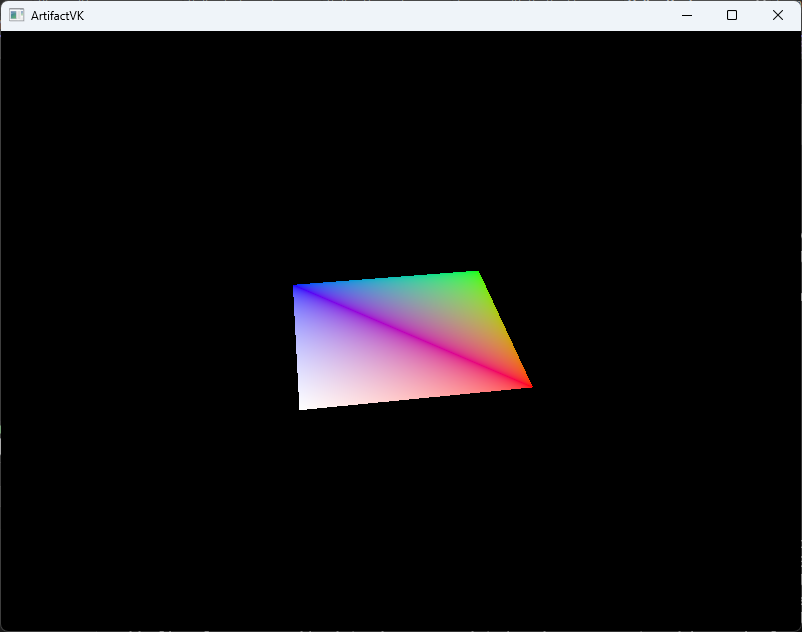

# ArtifactVK

ArtifactVK is meant to be a continuation of the Artifact-based engine and tools, providing a Vulkan backend to it.

Right now it's a simple app that's able to load models in a spec-compliant manner (no validation errors), with the use of dedicated transfer queues when available for uploading
of persistent buffers (index/vertex buffer). Window and swapchain management is handled for you.

## Usage
### Loading Raster Pipelines

```c++
    auto builder = RasterPipelineBuilder("spirv/shaders/triangle.vert.spv", "spirv/shaders/triangle.frag.spv");
    builder.SetVertexBindingDescription(Vertex::GetVertexBindingDescription());
    builder.AddUniformBuffer(m_PerFrameState.front().UniformBuffer);
    vulkanDevice.CreateRasterPipeline(std::move(builder), renderPass);
```

### Creating Uniform Buffers

```c++
     auto& uniformBuffer = vulkanDevice.CreateUniformBuffer<UniformConstants>();
```

### Sample Frame Render
```c++
    m_VulkanInstance.GetActiveDevice().AcquireNext(state.ImageAvailable);
    state.CommandBuffer.WaitFence();
    state.CommandBuffer.Begin();
    auto uniforms = GetUniforms();
    state.UniformBuffer.UploadData(GetUniforms());
    state.CommandBuffer.DrawIndexed(m_SwapchainFramebuffers.GetCurrent(), m_MainPass, m_RenderFullscreen, m_VertexBuffer, m_IndexBuffer, state.UniformBuffer);
    state.CommandBuffer.End(std::span{ &state.ImageAvailable, 1 }, std::span{ &state.RenderFinished, 1 });
    
    m_VulkanInstance.GetActiveDevice().Present(std::span{&state.RenderFinished, 1});
```



